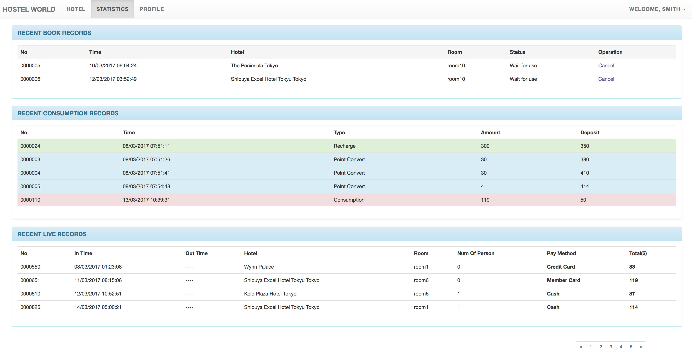
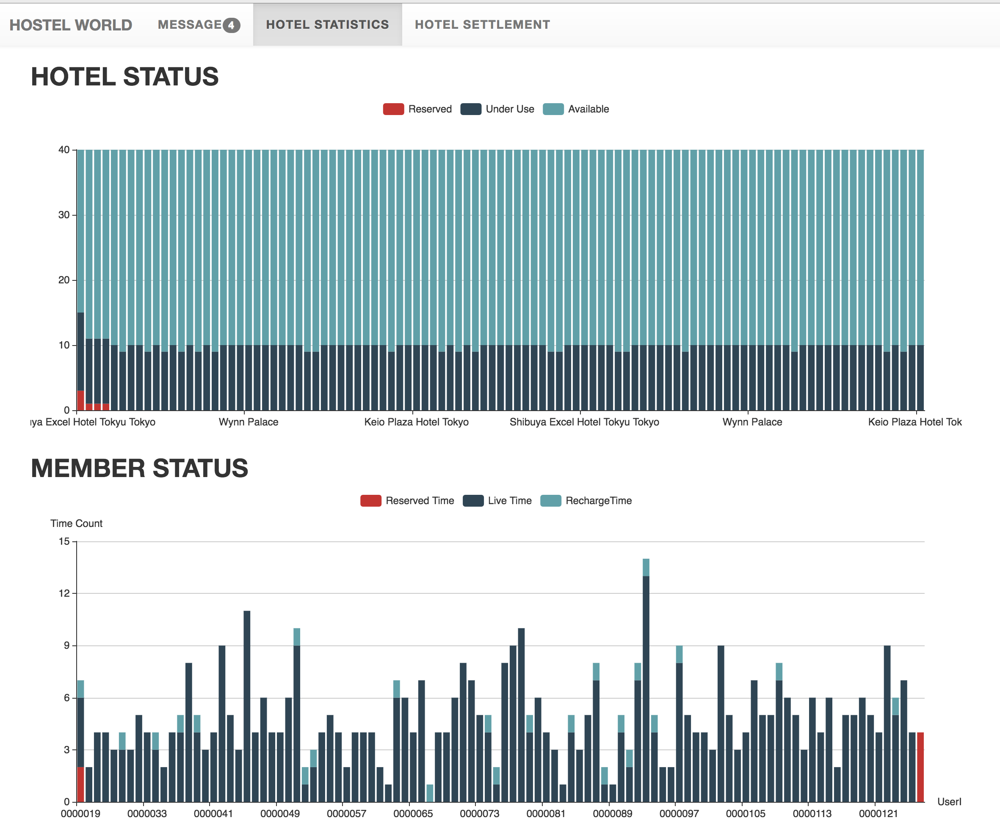

# Hostel World -- A Hotel System based on J2EE #

## Introduction ##

Hostel World is a J2EE Web Application implementing the basic functions of a hotel system including:

* Member
 	*  Register
 	*  Activate(By recharging more than $1000 to its account)
 	*  Suspend, resume, stop and cancel of the member qualification
 	*  Level, credit and discount of member account
 	*  check for hotel and room message, reserve them if they like
 	*  change profile
 	*  check personal statistics including the recently reserved records, lived records and consumption records
*  Hotel Manager
	*  Register
	*  Apply for editing hotel profiles or opening hotel
	*  Release the blueprint of rooms available
	*  Add records of serving customers
	*  Check hotel statistics
* General Manager
	* 	Approval/Deny the applications of the hotel
	*  Check Hostel World Statistics, including the living, reservation, consumption, financial status

## Features
* Spring Boot Ver1.5.1
* Spring Security
* Thymeleaf

## Get Started
### Requried:
 * MySQL
 * JDK1.8+

### Start Procedures
1. Clone the project to your PC
2. Import the database data in the docs/Hotel.sql to your MySQL
3. Start the SpringBootApplication

## Preview
### Login ###

---

### Member Index1 ###

---

### Member Index2 ###

---

### Member Statistics ###

---

### Manager Statistics1 ###

---

### Manager Statistics2 ###

## License ##
Sourcery is available under the MIT license. See [LICENSE](LICENSE) for more information.
